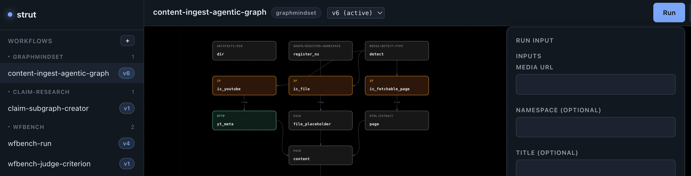

<h1 align="center">strut</h1>

<p align="center"><strong>An agent-native workflow engine.</strong><br/>
An AI builder that writes workflows for you, a visual editor, and an HTTP api.</p>

<p align="center">
  <a href="#quick-start">Quick start</a> ·
  <a href="#workflows">Workflows</a> ·
  <a href="#steps">Steps</a> ·
  <a href="#agents">Agents</a> ·
  <a href="#web-ui">Web UI</a> ·
  <a href="#use-as-a-library">Library</a>
</p>

<p align="center">
  
</p>

---

`strut` runs workflows that are small enough for a person to read and regular enough for an LLM to write. A workflow is an ordered list of steps, each with a type, a config, and optional dependencies. Templates like `{{ input.repo }}` wire step outputs together.

Steps do the work. Core steps cover HTTP, subprocesses, branching, loops, LLM calls, and full agent loops. Library steps add integrations like GitHub, Slack, and a knowledge graph. Custom steps are small TypeScript files you (or the AI builder) add at runtime.

Use it three ways:

1. **Run the server.** API plus web UI on one port.
2. **Embed it.** `createStrut()` gives you a Hono app and a `run()` function.
3. **Package it for the desktop.** A self-contained tarball with local speech-to-text built in.

## Quick start

Needs Node 22 or newer.

```bash
git clone https://github.com/stakwork/strut.git
cd strut
npm install
npm --prefix web install
```

Create a `.env` in the repo root:

```ini
STRUT_WORKSPACE_BACKEND=fs      # keep workflows on disk, no Neo4j needed
ANTHROPIC_API_KEY=sk-ant-...    # for llm/agent steps and the AI builder — or OPENAI_API_KEY,
                                # GOOGLE_API_KEY, OPENROUTER_API_KEY, XAI_API_KEY; pick the model in
                                # the AI chat. Keys can also be pasted under Secrets in the UI.
```

Then:

```bash
npm run dev
```

Open http://localhost:3000, and ask the AI builder for a workflow or draw one on the canvas.

Or run it in Docker, with the tools workflows call (ffmpeg, yt-dlp, tesseract, uv, …) already in the image. The compose runs the graph backend beside its own Neo4j (Browser at http://localhost:7475, `bolt://localhost:7689`, `neo4j` / `testtest`):

```bash
docker compose up --build
```

## Workflows

Steps run in order unless `depends` says otherwise. Any config value can hold a `{{ }}` expression that reads the run's `input`, the workflow's `params`, or an earlier step's output.

```yaml
name: review-pr
steps:
  - id: fetch
    type: github/fetch-pr
    config:
      owner: "{{ input.owner }}"
      repo: "{{ input.repo }}"
      pull_number: "{{ input.number }}"

  - id: review
    type: llm
    config:
      model: "{{ params.model }}"
      prompt: |
        {{ params.instructions }}

        {{ fetch.markdown }}

  - id: notify
    type: slack/post-message
    config:
      channel: "#code-review"
      text: "*{{ fetch.pr.title }}*\n{{ review.text }}"

params:
  model: claude-sonnet-5
  instructions: You are a senior engineer reviewing a pull request. Be concise.
```

`depends: [a, b]` waits for both steps; steps with the same dependencies run concurrently. `params` are the tunable knobs, and any run can override one without publishing a new version. Workflows are versioned, so every publish is a rollback point.

## Steps

Core steps: `http`, `exec`, `log`, `if`, `loop`, `foreach`, `subflow`, `wait`, `pack`, `llm`, `agent`.

Library steps ship with the engine and load their SDKs only when used: `github/*`, `slack/*`, `gdrive/*`, `html/*`, `graph/*`, and `meta/*` (steps that author and run other workflows).

Custom steps are one file each. Drop it in the workspace and it is ready to use:

```ts
// workspace/steps/custom/word-count.ts
import { z, defineStep } from "strut";

export default defineStep({
  type: "word-count",
  input: z.object({ text: z.string() }),
  output: z.object({ words: z.number() }),
  async run(cfg) {
    return { words: cfg.text.trim().split(/\s+/).length };
  },
});
```

## Agents

The `agent` step runs a model in a tool loop. **Tools are steps**: name any step types in `agentTools` and each one becomes a tool the agent can call. Every call is logged as a nested step in the run.

```yaml
- id: triage
  type: agent
  config:
    cwd: "{{ input.repoDir }}"
    system: You are a release engineer.
    prompt: Find the failing test and explain the root cause.
    agentTools: ["github/*", "graph/graph-search"]
    finalAnswer: The root cause, in two sentences.
```

The AI builder in the web UI is the same thing pointed at the `meta/*` steps. It can search the catalog, write a step, publish a workflow, run it, read the results, and iterate.

## Web UI

- **Canvas editor.** Drag to connect steps, click a node to edit it, add steps from a searchable picker.
- **Runs.** Watch events live, see each node go green, red, or yellow. Cancel, pause, and resume.
- **AI builder.** A chat that authors workflows and steps against your live workspace.
- **Dictation.** Local speech-to-text, built in.
- **Secrets.** Add credentials once, encrypted at rest.

## Use as a library

```bash
npm install stakwork/strut
```

```ts
import { createStrut } from "strut";

const strut = await createStrut();
await strut.listen(3000);                  // API + web UI
// or mount it: app.route("/strut", strut.app);

await strut.run("review-pr", { owner: "stakwork", repo: "strut", number: 42 });
```

Stores, the step registry, and a `services` bag for your steps are all injectable through `createStrut()`.

## Going deeper

- [specs/SPEC.md](specs/SPEC.md): the engine design and full HTTP API.
- [specs/RUN_CONTROL_SPEC.md](specs/RUN_CONTROL_SPEC.md), [specs/EVAL_SPEC.md](specs/EVAL_SPEC.md), [specs/EVOLVE_SPEC.md](specs/EVOLVE_SPEC.md): run control, evals, and self-evolving workflows.
- [AGENTS.md](AGENTS.md): environment variables, auth, the Neo4j graph backend, desktop packaging, and how to work on the codebase.

`npm test` runs the unit suite.

## License

[Apache 2.0](LICENSE)
